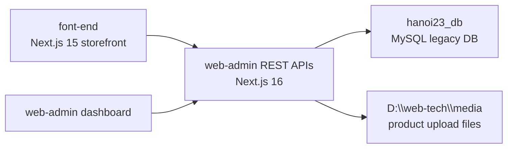
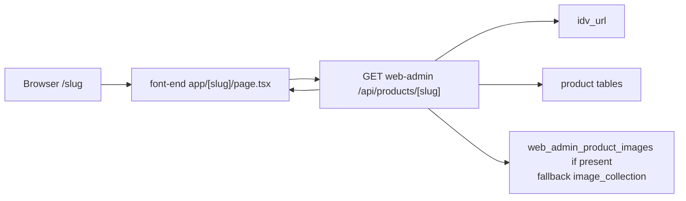
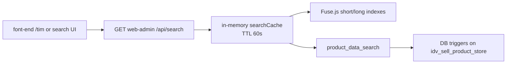
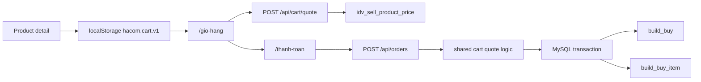
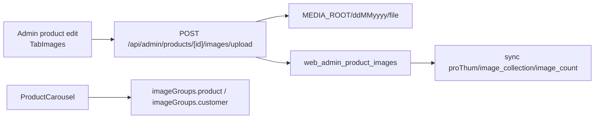

# HACOM Architecture

Last audited: `2026-07-07`

## Boundaries



- `web-admin` is the only app that may connect to `hanoi23_db`.
- `font-end` uses `NEXT_PUBLIC_API_URL` or local rewrites to call `web-admin`.
- Product upload files live outside the Next app under `MEDIA_ROOT`; `/api/media/[...path]` serves them.
- Admin mutations are gated by `ADMIN_WRITE_ENABLED=true`.

## Product/Category Slug Flow



`/api/products/[slug]` returns either a category payload or product payload. Product payload keeps legacy `images: string[]` and also returns typed image data:

```ts
{
  images: string[];
  imageItems: Array<{ url: string; alt: string; type: 'product' | 'self' | 'customer' }>;
  imageGroups: {
    product: imageItemsForProductAndSelf;
    customer: imageItemsForCustomer;
  };
}
```

## Category Listing Flow

For category slugs, `font-end/src/app/[slug]/page.tsx` fetches initial data in parallel:

- `GET /api/products?category_id=...`
- `GET /api/categories?parentId=...`
- `GET /api/categories/price-bounds?categoryId=...`
- `GET /api/categories/attributes?categoryId=...`

After hydration, `CategoryClient` fetches product list again when URL filters, sort, or page changes. Attribute/value data is sanitized on backend and defensively filtered again on frontend.

## Search Flow



Search components:

- DB table: `product_data_search(product_id PK, data_search TEXT)`.
- DB function: `webtech_normalize_product_search`.
- DB triggers: `webtech_product_search_after_insert`, `webtech_product_search_after_update`.
- Code cache: `web-admin/src/lib/searchCache.ts`.
- Ranking/facets: `web-admin/src/lib/productSearch.ts`.
- Migration: `web-admin/src/lib/searchInfrastructure.ts`.
- API: `web-admin/src/app/api/search/route.ts`.
- Webhook cache update: `web-admin/src/app/api/webhook/update-search/route.ts`.

The search cache joins products, prices, URLs, brands, and product attributes. It builds facets from `idv_product_attribute` and uses synonyms/exclusion rules in code.

## Cart and Checkout Flow



Client prices are never trusted for orders. `POST /api/orders` re-quotes, validates available products, inserts `build_buy`, then inserts `build_buy_item` rows inside one transaction.

## Product Image Upload Flow



Image types:

- `product`: official product images.
- `self`: HACOM self-shot images; storefront groups these with product images.
- `customer`: customer images; storefront shows these in a separate tab.

Current code is implemented. Live DB audit did not show `web_admin_product_images` yet; run `admin:migrate` with writes enabled to create it.

## Admin Write Model

Admin helper tables:

- `web_admin_sequence`: allocates new product ids.
- `web_admin_entity_registry`: marks entities created by the new Admin API and protects legacy rows from permanent delete.
- `web_admin_product_images`: image metadata table created by current code when admin migration/write path runs.

Important rule: hide/restore legacy entities; permanent delete only for API-created entities in the registry.

## Runtime DB Model

Core tables:

- Product: `idv_sell_product_store`, `idv_sell_product_price`, `idv_sell_product_info`.
- Category: `idv_seller_category`, `idv_product_category`.
- Attributes: `idv_attribute`, `idv_attribute_value`, `idv_attribute_category`, `idv_product_attribute`.
- URLs: `idv_url`.
- Orders: `build_buy`, `build_buy_item`.
- Search: `product_data_search`.
- Images legacy/reference: `idv_sell_product_image_name`, `idv_product_image_stock`, `idv_customer_product_image`, `product_image_folder_counter`.

Legacy DB has partial/no physical FK coverage. Always validate and use transactions at app level.

## Production Readiness Rules

- Add auth before enabling admin writes in production.
- Keep CORS allowlisted in production.
- Add rate limiting/idempotency for public write endpoints.
- Do not return raw DB errors from public APIs.
- Keep TinyMCE loaded only through `RichTextEditor`.
- Use `NODE_OPTIONS=--max-old-space-size=4096` for reliable local builds on this workspace.

