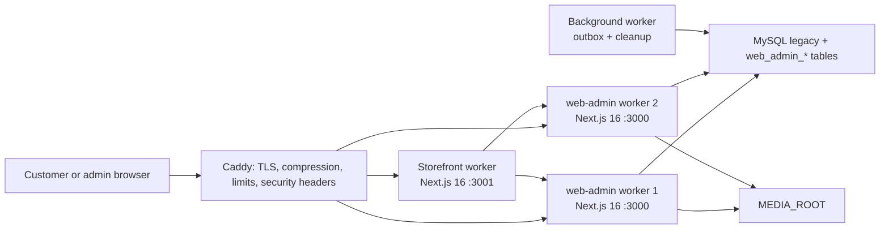
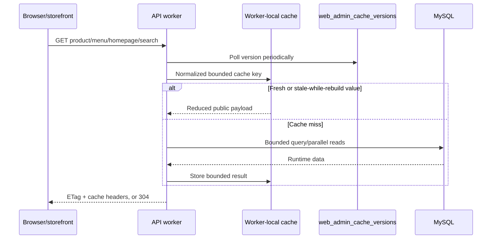
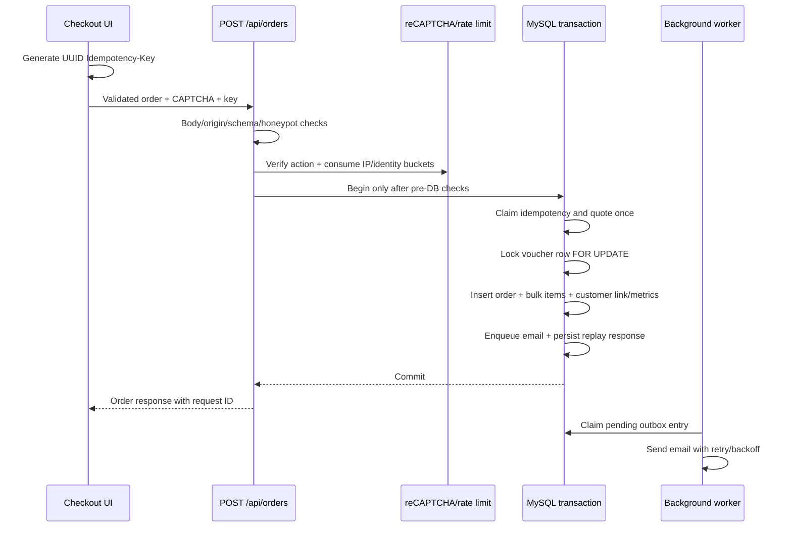

# HACOM Architecture

Last verified: `2026-07-18`

## PC Builder bounded context

`font-end` owns only the interactive builder/checkout UI and versioned local draft. Every candidate list, quote, auto recommendation, share read, save and order crosses a `web-admin` API; no database client or price/compatibility decision exists in the storefront.

`web-admin` resolves verified catalog facts from legacy `idv_attribute*` relations plus additive typed metrics. Published rule revisions use a closed operator set (`equality`, `set_contains`, `numeric_lte`, `headroom`, `requires`). Quote and order both re-read sellability/prices and re-run the same engine. Auto Gaming preloads bounded shortlists, prunes invalid partial builds, caps the beam at 300, and re-quotes returned builds.

Saved builds live in `web_admin_pc_builds` / `web_admin_pc_build_items`. Guest tokens are random, stored only as SHA-256, read-only and expire after 90 days; account builds are owner-scoped and persistent. Orders remain in `build_buy` / `build_buy_item`, with additive metadata for `order_type=pc_builder`, build ID, assembly and rule revision.

## System boundaries and runtime

### Combo commerce flow

The storefront product-detail payload receives only active combo-set/group summaries. Group products are lazy-loaded from `GET /api/combo-sets/[setId]/groups/[groupIndex]`; all displayed totals and order writes are based on server-side `POST /api/combo-cart/quote` repricing. The browser’s separate `hacom.combo-cart.v1` record contains only anchor/set/revision and product IDs, group indexes, and quantities. `POST /api/combo-orders` locks and re-quotes inside the order transaction, stores an immutable allocation snapshot, and marks metadata as `order_type=combo`.



- `web-admin` owns all MySQL access, public/admin/customer APIs, admin UI, media serving, and background jobs.
- `font-end` owns the customer UI and calls `web-admin`; it never receives DB credentials.
- `search-tool` is a historical prototype. Production search is part of `web-admin`.
- PM2 configuration starts two API/admin workers, one storefront worker, and one background worker. Each API worker defaults to a 12-connection pool with bounded queue/connect timeouts.
- Liveness checks the process. Readiness checks DB connectivity and required performance tables.

### Database character-set boundary

Runtime tables in `it_tech_db` use UTF-8: `utf8mb4_unicode_ci`, except two existing `utf8mb4_0900_ai_ci` tables that were deliberately preserved. The accepted runs 2-8 recovery cleanup removed the last Latin-1 recovery objects; live verification now reports zero Latin-1 tables and columns. Migration tooling is owned by `web-admin`, runs offline under an advisory lock, validates the audited schema/index/row snapshot, and never grants MySQL access to `font-end`.

## Legacy import flow

Legacy imports are operational jobs owned by `web-admin`; neither the storefront nor `search-tool` connects to the source or MySQL. The PCMarket category adapter fetches two complete HTTPS snapshots, validates pagination and records, compares canonical SHA-256 hashes, rewrites/sanitizes description HTML, validates the category tree, and performs a read-only target preflight.

The product adapter composes stable snapshots from the product, brand, and attribute exporters. It preserves source IDs, imports brand/attribute/value definitions before product rows and junctions, applies the staged category-attribute links, rebuilds search rows, and records incomplete variant/config/comboset structures as pending audit entities instead of guessing runtime data. Product HTML is sanitized and relative media is normalized to HTTPS PCMarket URLs. A shared image resolver preserves absolute HTTPS URLs and only expands legacy filenames to the HACOM media origin; neither application downloads PCMarket binaries.

The standalone brand adapter uses the same normalization as future product imports. It canonicalizes the unassigned sentinel `0 -> 96` as the managed public `PCM` brand, E-DRA `34 -> 25`, and TEAMGROUP `57 -> 31`. Source ID 96 is reserved and rejected unless it matches the PCM policy. The adapter preserves every source mapping in audit, stages `idv_brand`/`idv_brand_info` as `utf8mb4_unicode_ci`, and atomically swaps those tables together with MyISAM `idv_brand_category` and `idv_movie`. Related InnoDB product references update transactionally, search is rebuilt, and rollback restores both swapped MyISAM state and relation snapshots. Public `GET /api/brands/[slug]` serves canonical metadata and enabled products; homepage bootstrap returns only canonical enabled brands with at least one enabled product, with PCM ordered last. The storefront consumes these APIs for `/brand/[slug]` and the homepage brand grid.

The article-category adapter imports only the PCMarket news taxonomy. It uses the same bounded double-snapshot/hash boundary, preserves source IDs and `.html` slugs, writes `idv_seller_news_category`, canonical `idv_url`, registry, record, and map rows in one InnoDB transaction, and retains four run-scoped pre-state backups. Initial apply is blocked unless categories/articles/junctions/category routes/menu references are still empty. It never creates articles or menus and never downloads media; future PCMarket media remains a validated absolute HTTPS URL. Rollback restores the exact pre-run category/route/registry/map state by run ID.

The article adapter consumes the bounded paginated PCMarket export twice and applies only a matching canonical snapshot. Run 7 used 67 pages and preserves 668 valid source IDs/routes, quarantines ID 83, sanitizes HTML and HTTPS media, stages the MyISAM category junction before an atomic table swap, and writes article/content/routes/registry/maps transactionally. Public news APIs filter inactive rows, deduplicate category membership, return absolute image URLs and bounded related news. The storefront consumes those APIs through `internalApiUrl` and sanitizes article HTML again before rendering; it never reads MySQL.

Public news list/detail reads use the measured `(status,createDate DESC,id DESC)` and `(url,status)` indexes. Category totals, lists, and related-news membership are formed with `UNION DISTINCT` across the primary `catId` and junction sources, avoiding the former `OR` join/dependent subquery; the junction branches use covering composite indexes in both category-to-article and article-to-category directions. One shared active-category query supplies both `/api/news` and `/api/news-category/[slug]`, joins additive featured metadata, and returns only public navigation fields. Category detail accepts a fixed `latest|popular` order, loads navigation and four global most-viewed articles in parallel with category lookup, then resolves membership/count/trail after the category ID is known.

Article detail first confirms the active slug, then starts active-category navigation, four global most-viewed articles and its category trail in parallel. Related news waits only for the displayed trail leaf and uses `UNION DISTINCT` across primary and junction membership for that single category, excludes the current article, orders by `createDate DESC,id DESC`, caps at six and never falls back to global content. The API retains `data` and adds `categories` plus `popularNews` for the reusable sidebar.

The storefront news-category surface remains server-first and consumes a fixed page size of 21: three articles populate the reference bento and up to 18 populate the lower list. The category filter/sort strip is not rendered; direct `sort` URLs remain API-compatible and canonical pagination preserves them. Share/copy is the only hydrated control. `FeaturedNewsCategories` is a reusable presentation-only Server Component that receives `NewsCategory[]`, renders safe category links and uses the public image or one local `Newspaper` fallback. `MostReadNews` is a separate presentation-only Server Component that receives `NewsItem[]` and owns the ranked article links and view counts without fetching or hydrating. The reusable PC-build promotion is static storefront markup, sticks at a 110px top offset only at the desktop breakpoint, and has no database or admin dependency.

The `/tin-tuc` landing is a separate fixed composition exposed by `GET /api/news/landing`. `web-admin` resolves configured category slugs to active IDs, deduplicates primary and junction membership, and returns at most 11 newest news plus six newest review articles with stable date/ID ordering. The route loads active category navigation and the PCM YouTube Atom feed in parallel; the feed is bounded, channel/video IDs are validated, responses are cached for 15 minutes, and an external failure degrades only the video block. `font-end` renders the reference 2/3/6 and 2/4 structures server-side. Only the playlist selection/play surface hydrates, and the YouTube no-cookie iframe is created after interaction. The reusable promotion is explicitly normal-flow on this landing route.

The storefront article-detail surface is also server-first and binds sanitized public content into `single-bai-viet.html`'s 70/30 structure. The right sidebar imports the two reusable presentation panels and promotion directly; the former same-category widget is not rendered. Only the accessible Facebook/X/copy controls hydrate. Tags are newline-normalized and deduplicated for presentation, absent tags leave only share controls, and missing author data uses `PCM`.

The active local application database is `it_tech_db`. `hanoi23_db` is retained as a read-only legacy source. `db:bootstrap-safe-config` is a separate guarded job that compares whitelist schema/index/engine definitions, requires an empty business target, copies MyISAM shipping data with compensating cleanup, copies the InnoDB whitelist transactionally in FK-safe order, transforms admin login state, and records the run without logging password hashes. `db:logical-backup -- --verify-restore` captures DDL/data plus SHA-256 manifests outside Git and verifies them through a disposable restore before an artifact is accepted.

Apply requires the admin write gate, exact database name/hash, explicit replacement confirmation, full-backup acknowledgement, and maintenance-window acknowledgement. A MySQL advisory lock serializes runs. The job populates a `CREATE TABLE ... LIKE idv_seller_category` staging table, creates run-scoped backups before cutover, swaps category tables with `RENAME TABLE`, then detaches old product/attribute/configuration relations. `web_admin_import_runs`, `web_admin_import_records`, and `web_admin_import_entity_map` contain audit state and pending attribute relations; raw source snapshots stay outside Git. Read-only `--verify-applied` re-downloads the source twice, matches the latest applied hash, and checks runtime relations without requiring an empty target. Rollback restores state by run ID only while `rollback_closed_at` is null. The guarded recovery cleanup acquires every importer lock, accepts only exact run-derived table names, requires a restore-verified backup manifest, records acceptance/closure/cleanup audit fields, and then drops the whitelisted recovery tables.

Product apply uses a transaction for the InnoDB catalog graph and a run-scoped staging/swap with compensating restore for MyISAM `idv_brand_category`. Search routines/triggers are installed independently without running the broad admin seeder. Product rollback reverses routes/search/junctions/definitions, restores the prior MyISAM table and search-infrastructure state, and changes the category attribute audit links back to pending.

For single-slug storefront requests, a lightweight `GET /api/categories/route-status` guard distinguishes non-category slugs from inactive category routes before React streaming begins. Non-category/product slugs continue normally, enabled categories continue normally, and inactive category routes are rewritten to a response with an actual HTTP 404 status.

Catalog slug resolution classifies exact `module:product/view:category/view_id:<id>` and `module:product/view:product-detail/view_id:<id>` paths. Canonical route types are required for new importer/admin writes; exact legacy `url_type='0'` catalog paths remain read-compatible during rollout, while article/news and malformed prefixes are rejected. `db:repair-catalog-routes` is dry-run by default and can update only the exact category join under database, maintenance, write-gate, backup-manifest, preimage-hash, advisory-lock, and confirmation guards. Its rollback preimage is an external SHA-256 artifact, not a recovery table.

Public category product/list/count/price/brand/attribute reads first resolve one bounded recursive scope containing the enabled root and enabled descendants. All product-facing queries reuse that scope and deduplicate product IDs; `GET /api/categories?parentId=...` aggregates each immediate child's enabled subtree. Hierarchy expansion uses `idx_webtech_category_parent_status(parentId,status,id)`, while product membership continues through the existing `(category_id,pro_id)` junction index. Category admin save/delete/status operations invalidate product and catalog-detail cache versions.

## Public read flow and cache

### Page-view write flow

Product detail/category and news detail/category GETs remain cacheable and side-effect free. After a successful page hydrates, a minimal storefront client component sends `{ eventId, path }` to the same-origin `/api/page-views` rewrite. `web-admin` validates the configured origin, exact same-origin referrer, fetch metadata, UUID, rate limits and the canonical public entity resolved from the path.

Accepted UUIDs are inserted once into `web_admin_page_view_events`. The background worker locks bounded pending batches with `SKIP LOCKED`, aggregates by `(entity_type, entity_id)`, increments `web_admin_page_view_totals`, and marks the exact events processed in one InnoDB transaction. Processed events remain for one hour to absorb delayed retries. Public/admin readers expose the canonical total as the existing `visit` field and fall back to the legacy column only before a total row exists.

Product detail now has two cacheable compositions. `include=full` remains the compatibility default. The storefront requests `include=core` for above-the-fold catalog, image, price, variant, combo, voucher, promotion, video, and specification data, then streams `/api/products/[slug]/supplemental` for recommendations, related posts, and buying guides through `Suspense`. Recently viewed data remains browser-local and is loaded only near the viewport.

Worker-local product caches are bounded by entry count and estimated bytes. Fresh entries return directly; expired entries inside the stale window return immediately while one background flight rebuilds them. Negative slug results use a short TTL. DB cache versions still invalidate both API workers.

Operational visibility is exposed through token-protected `/api/internal/metrics`; sampled, bounded, same-origin Web Vitals batches enter `/api/telemetry/web-vitals`. Browser API calls stay relative to the storefront origin, while server components use `API_INTERNAL_URL`.



- Menu, banner, homepage, product, category, and search routes return runtime-only fields.
- Managed menus use `web_admin_menus -> web_admin_menu_versions -> web_admin_menu_items`. Header, homepage, Footer, and Bottom Footer have separate draft/publish owners and public endpoints. Publication bumps the matching cache version; storefront Footer consumers retain code fallback data so a read outage does not change the established DOM structure.
- Homepage bootstrap accepts one bounded featured-collection identity and product limit. It verifies the collection ID/slug pair, loads only active collection metadata plus the requested sellable product cards, and returns that lean payload alongside the existing homepage data under the same cache/single-flight boundary. Collection mutations bump the shared public-product cache version so clustered workers discard affected bootstrap responses.
- Homepage category-feature reads resolve each enabled root through the shared enabled descendant-scope loader, deduplicate product membership, and return at most nine sellable cards ordered by legacy display ordering then product ID. Feature targets are derived server-side from the category `request_path` with the category `url` as fallback; stored/client `target_url` values cannot redirect the storefront. The additive helper-table color controls only the Section 11 container and does not alter legacy category contracts.
- Storefront category routes request the bounded `configured` feature scope: a box may be reused when enabled for homepage or by the retained legacy category-page flag. This does not mutate either flag. The payload renders once in the existing category banner slot; filtered product-list refreshes retain the same scope and never insert the hero into the product grid.
- Homepage product/category/promotion rails keep their server-rendered markup and share one homepage-only raw carousel runtime. The runtime is loaded after hydration, initializes every `.carousel-track` except the independently controlled hero, rotates DOM nodes around a one-card transform buffer, and exposes lifecycle-only `init`/`destroy` hooks so the Next.js page adapter can remove clones, timers and listeners before a remount.
- Category attribute metadata and product filtering share one versioned resolver. Stored `idv_attribute_value.api_key` is the public value identity. Global attributes apply without materialized category links; Local mappings are preferred, with a read-only fallback that admits only values actually assigned to enabled products in the enabled category/descendant scope.
- Product/news detail and category payloads carry a bounded root-to-leaf `categoryTrail`; the storefront renders it with one shared semantic breadcrumb component and does not issue a follow-up breadcrumb request.
- Product-detail payloads carry server-resolved similar products and related articles. Recently viewed IDs/snapshots remain in browser `localStorage`; the client performs one bounded batch refresh through `/api/products?ids=...`, while checkout continues to requote all prices server-side.
- Product-detail payloads carry up to 50 currently active, non-exhausted voucher summaries that apply globally or through a selected category ancestor. These summaries are discovery data only; cart quote and order creation re-check time, quota, minimum order, eligible items, and current prices.
- Product-detail payloads carry one ordered `productPromotions` projection from two sources. Up to 50 active managed records match a direct SKU or category ancestor and retain manual-priority/end-time/id order; sanitized non-empty lines from legacy `specialOffer` are appended afterward. Managed items expose `source: managed`, numeric IDs and optional detail links; editor items expose stable string IDs, `source: product-editor`, plain-text fallback and allowlisted rich HTML. Raw `specialOffer` never leaves `web-admin`, and neither source enters cart quote or order logic.
- Product-detail payloads normalize up to 20 legacy PHP-serialized `video_code` entries into public `{ id, embedUrl, description }` YouTube-only records and expose `hasSpecifications` for meaningful specification HTML. Raw legacy video data never leaves `web-admin`; invalid/off-domain/duplicate entries are omitted, and the storefront mounts only the active modal iframe.
- Product and product-category slug payloads optionally carry one bounded entity-specific buying guide. It is loaded only on the detail route, never on product lists/search/homepage/news, and uses the dedicated `public_catalog_details` cache version for selective invalidation.
- Product detail optionally carries one bounded `productGroup` resolved from `config_group`, its ordered attributes/values, and sellable product rows. Each card's thumbnail is resolved in that query path from `idv_sell_product_store.proThum`, then parsed from legacy `image_collection` if needed; Product Group values no longer have image/color columns or API fields. PHP-serialized mappings are normalized defensively; malformed/orphan/inactive/zero-price/slugless rows are omitted. The storefront makes no follow-up variant request, and group mutations invalidate only catalog-detail caches.
- Search and other expensive refreshes use single-flight behavior so one worker rebuilds once per cache key.
- Admin mutations bump a DB-backed cache version. Other workers observe it and clear their local cache.
- Query, filter count, page, limit, product count, and cart cardinality are bounded to protect CPU, memory, and cache-key growth.

## Checkout, voucher, and email flow



- Client price, voucher state, customer ID, payment state, and ownership data are never authoritative.
- `Idempotency-Key` is required. Same key/same payload replays the stored response; same key/different payload returns `409`.
- Voucher quota and redemption share the order transaction. Limited vouchers cannot decrement below zero.
- Email is outside request latency but its outbox record is committed atomically with the order.

## Customer authentication and forms

- Registration stores a short-lived challenge and hashed OTP; a customer row is created only after verification.
- Login reads Argon2id and legacy bcrypt hashes. Successful bcrypt login opportunistically upgrades the stored hash.
- Customer sessions store hashed tokens, absolute expiry, idle window, and sliding idle expiry. Session touch is throttled.
- Anonymous high-risk actions use action-specific reCAPTCHA v3, honeypot/minimum-fill signals, and atomic rate-limit buckets by IP plus hashed identifier.
- Authenticated customer writes require session/origin checks and rate limits; CAPTCHA is reserved for anomalous/step-up behavior.
- Customer favorites use additive relation rows keyed by `(customer_id, product_id)`. The browser registers only mounted real catalog IDs after `/api/customer/me` succeeds, batches up to 100 status checks, keeps one in-memory customer-scoped state store, and performs optimistic idempotent PUT/DELETE. The separate `/yeu-thich` list joins current public catalog data and paginates by descending favorite ID without `COUNT(*)`; hidden products are omitted and customer deletion cascades.
- Admin writes require session, RBAC, same-origin handling, audit logging, and the write gate. Admin login adds account/IP throttling and risk-based CAPTCHA.

## API and error contract

Public write failures use:

```json
{
  "success": false,
  "error": {
    "code": "VALIDATION_ERROR",
    "message": "Human-readable Vietnamese message",
    "fields": { "email": "Field-specific message" },
    "requestId": "request-correlation-id"
  }
}
```

- Every response should include `X-Request-ID`; `429` also includes `Retry-After`.
- Order creation additionally requires `Idempotency-Key` and `recaptchaToken`.
- Signed search webhook requires `X-Webhook-Timestamp`, `X-Webhook-Nonce`, and `X-Webhook-Signature`.
- Public CORS is restricted to the configured storefront origin; preflight does not emit wildcard origins.
- Storefront write forms mirror canonical backend validation for immediate UX, preserve structured `status/code/fields/requestId/retryAfter`, and focus/announce field errors. Customer, order, and combo CAPTCHA token schemas intentionally allow an empty browser token to reach the verifier so the explicit non-production bypass can operate; the verifier remains authoritative and production rejects missing tokens.
- Checkout delivery now carries additive `provinceCode` and `wardCode` values beside display names. Receiver and invoice payloads use typed conditional schemas rather than open records; order transaction and idempotency boundaries are unchanged.

## Database model

- Legacy catalog/content/order tables remain canonical where already used. Runtime character data has been normalized to UTF-8; accepted importer recovery objects have been removed after restore verification.
- New transactional/security/runtime state lives in additive InnoDB `web_admin_*` tables.
- Article-category featured state lives in the 1:1 additive `web_admin_article_category_meta` helper keyed by the logical `idv_seller_news_category.id`; admin reads default missing metadata to `0`, while create/update/delete and the focused toggle reconcile it transactionally.
- No code should assume a physical FK exists between legacy tables.
- Search uses `product_data_search` plus the normalize function, insert/update triggers, and FK to products.
- Customer, customer-favorite, voucher, product-promotion, idempotency, outbox, rate-limit, cache-version, and webhook-nonce state is transactional InnoDB.

The active `it_tech_db` snapshot contains 292 physical tables: 164 InnoDB and 128 MyISAM after the additive article-category metadata and page-view migrations on `2026-07-16`. It has no importer stage/restore/recovery tables and no Latin-1 tables or columns. Consumers must still use named table contracts rather than infer schema from totals. The live inventory is 788 product categories, 90 brands, 4,712 products/search rows, 8 article categories (4 imported and 4 local), 668 articles/content rows, and 705 article-category links. See `web-admin/database-docs/DATABASE_SCHEMA.md` for schema details and `DATABASE_TRANSFER.md` for the verified restore path.

## Media security

- Uploads are stored under `MEDIA_ROOT/ddMMyyyy/random-name.ext` and served through `/api/media/[...path]`.
- Routes enforce size/extension/MIME/signature rules and ensure the resolved path stays under `MEDIA_ROOT`.
- Shared admin rich-text image uploads use `POST /api/admin/editor-images/[scope]/upload`. The whitelisted scope selects the existing product/category/collection/article permission, and accepted JPEG/PNG/WebP/GIF files are stored under `MEDIA_ROOT/rich-text/<scope>/<ddMMyyyy>/<uuid>.<ext>` before TinyMCE receives a durable `/api/media/...` source URL.
- Product image metadata synchronizes to legacy thumbnail/collection/count fields until all consumers migrate.

## Performance and release targets

- Target host: one 8 vCPU/16 GB server running apps and MySQL.
- Target usage: 1,500 online sessions, peak 150 RPS, up to 10 checkouts/s.
- SLOs: public read p95 <300 ms, quote p95 <500 ms, order p95 <1.5 s excluding email, error rate <0.5%.
- Frontend: LCP p75 <2.5 s, INP <200 ms, CLS <0.1.
- The full production-like k6 test remains mandatory. Local benchmarks and health checks do not certify capacity.
