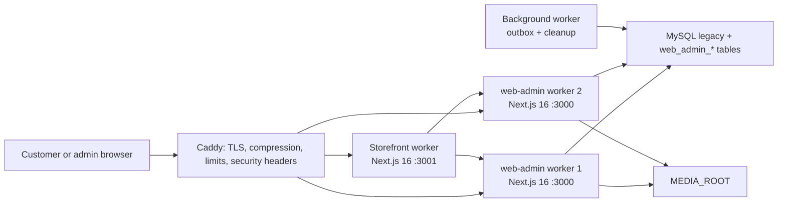
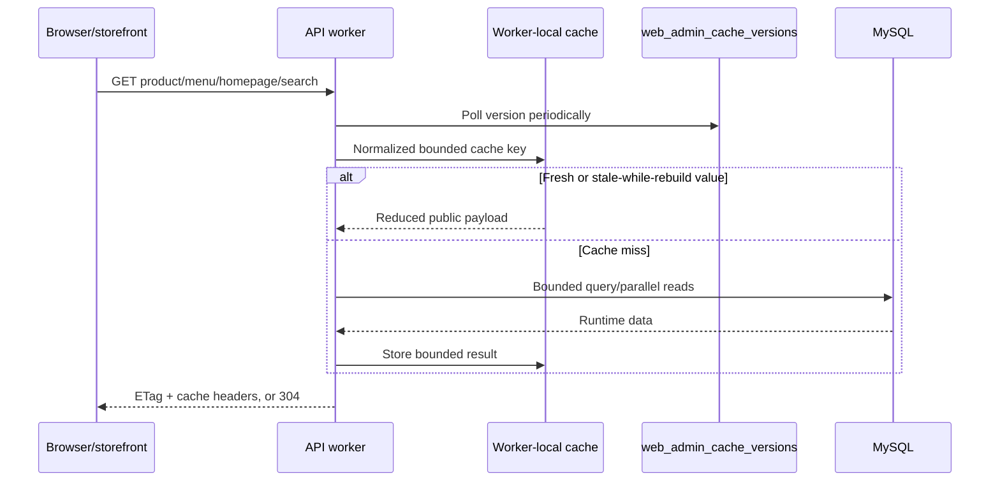
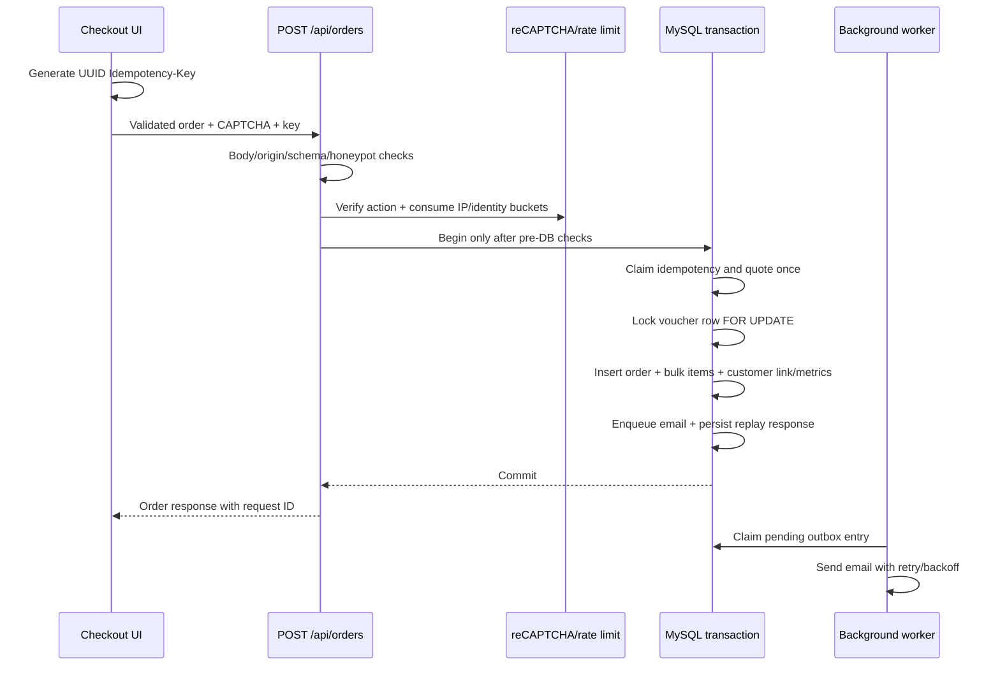

# HACOM Architecture

Last verified: `2026-07-11`

## System boundaries and runtime



- `web-admin` owns all MySQL access, public/admin/customer APIs, admin UI, media serving, and background jobs.
- `font-end` owns the customer UI and calls `web-admin`; it never receives DB credentials.
- `search-tool` is a historical prototype. Production search is part of `web-admin`.
- PM2 configuration starts two API/admin workers, one storefront worker, and one background worker. Each API worker defaults to a 12-connection pool with bounded queue/connect timeouts.
- Liveness checks the process. Readiness checks DB connectivity and required performance tables.

## Public read flow and cache



- Menu, banner, homepage, product, category, and search routes return runtime-only fields.
- Search and other expensive refreshes use single-flight behavior so one worker rebuilds once per cache key.
- Admin mutations bump a DB-backed cache version. Other workers observe it and clear their local cache.
- Query, filter count, page, limit, product count, and cart cardinality are bounded to protect CPU, memory, and cache-key growth.

## Checkout, voucher, and email flow



- Client price, voucher state, customer ID, payment state, and ownership data are never authoritative.
- `Idempotency-Key` is required. Same key/same payload replays the stored response; same key/different payload returns `409`.
- Voucher quota and redemption share the order transaction. Limited vouchers cannot decrement below zero.
- Email is outside request latency but its outbox record is committed atomically with the order.

## Customer authentication and forms

- Registration stores a short-lived challenge and hashed OTP; a customer row is created only after verification.
- Login reads Argon2id and legacy bcrypt hashes. Successful bcrypt login opportunistically upgrades the stored hash.
- Customer sessions store hashed tokens, absolute expiry, idle window, and sliding idle expiry. Session touch is throttled.
- Anonymous high-risk actions use action-specific reCAPTCHA v3, honeypot/minimum-fill signals, and atomic rate-limit buckets by IP plus hashed identifier.
- Authenticated customer writes require session/origin checks and rate limits; CAPTCHA is reserved for anomalous/step-up behavior.
- Admin writes require session, RBAC, same-origin handling, audit logging, and the write gate. Admin login adds account/IP throttling and risk-based CAPTCHA.

## API and error contract

Public write failures use:

```json
{
  "success": false,
  "error": {
    "code": "VALIDATION_ERROR",
    "message": "Human-readable Vietnamese message",
    "fields": { "email": "Field-specific message" },
    "requestId": "request-correlation-id"
  }
}
```

- Every response should include `X-Request-ID`; `429` also includes `Retry-After`.
- Order creation additionally requires `Idempotency-Key` and `recaptchaToken`.
- Signed search webhook requires `X-Webhook-Timestamp`, `X-Webhook-Nonce`, and `X-Webhook-Signature`.
- Public CORS is restricted to the configured storefront origin; preflight does not emit wildcard origins.

## Database model

- Legacy catalog/content/order tables remain canonical where already used. Most are `latin1_swedish_ci`, and 128 tables remain MyISAM.
- New transactional/security/runtime state lives in additive InnoDB `web_admin_*` tables.
- No code should assume a physical FK exists between legacy tables.
- Search uses `product_data_search` plus the normalize function, insert/update triggers, and FK to products.
- Customer, voucher, idempotency, outbox, rate-limit, cache-version, and webhook-nonce state is transactional InnoDB.

The configured database snapshot on `2026-07-11` contains 280 tables: 152 InnoDB and 128 MyISAM. See `web-admin/database-docs/DATABASE_SCHEMA.md` for the current schema handoff.

## Media security

- Uploads are stored under `MEDIA_ROOT/ddMMyyyy/random-name.ext` and served through `/api/media/[...path]`.
- Routes enforce size/extension/MIME/signature rules and ensure the resolved path stays under `MEDIA_ROOT`.
- Product image metadata synchronizes to legacy thumbnail/collection/count fields until all consumers migrate.

## Performance and release targets

- Target host: one 8 vCPU/16 GB server running apps and MySQL.
- Target usage: 1,500 online sessions, peak 150 RPS, up to 10 checkouts/s.
- SLOs: public read p95 <300 ms, quote p95 <500 ms, order p95 <1.5 s excluding email, error rate <0.5%.
- Frontend: LCP p75 <2.5 s, INP <200 ms, CLS <0.1.
- The full production-like k6 test remains mandatory. Local benchmarks and health checks do not certify capacity.
