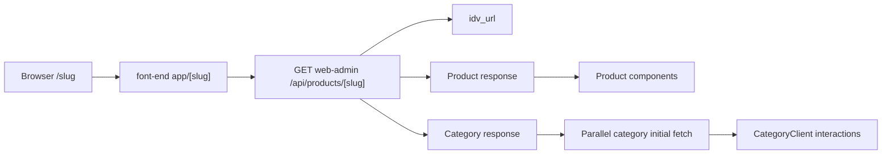
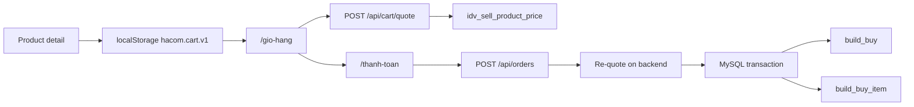

# Kiến trúc hệ thống HACOM

Tài liệu này mô tả ranh giới giữa storefront, backend/admin và database tại thời điểm `2026-07-06`.

## 1. Ranh giới trách nhiệm

### `font-end`

- Hiển thị storefront tại cổng `3001`.
- Không import `mysql2`, không đọc `DATABASE_URL`, không truy vấn DB.
- Server Component được phép gọi REST API của `web-admin` để SSR.
- Client Component dùng cho cart, filter, carousel và các tương tác trình duyệt.

### `web-admin`

- Chạy Admin Dashboard và REST API tại cổng `3000`.
- Là nơi duy nhất kết nối `hanoi23_db` qua `src/lib/db.ts`.
- Giá, trạng thái bán và dữ liệu tạo đơn phải được xác thực tại đây.
- TinyMCE được phục vụ offline từ `public/` và chỉ tải khi editor mount.

### `hanoi23_db`

- Database legacy gồm `241` bảng tại lần kiểm tra gần nhất.
- Không có hệ thống foreign key vật lý đầy đủ; phần lớn quan hệ được đảm bảo ở tầng ứng dụng.
- Toàn bộ bảng hiện dùng collation `latin1_swedish_ci`; cần thận trọng với encoding tiếng Việt.

## 2. Luồng slug và danh mục



`app/[slug]/page.tsx` fetch dữ liệu ban đầu ở server. Nếu slug là category, server gọi song song products, subcategories, price bounds và attributes trước khi render `CategoryClient`.

Khi đổi trang hoặc filter:

- Chỉ product list được fetch lại.
- Metadata category không fetch lại nếu category không đổi.
- Request client có `AbortController` để tránh stale response.
- Attribute/value legacy bắt đầu bằng `javascript:`, `http://`, `https://`, `data:` hoặc `//` bị loại khỏi filter response.

## 3. Luồng giỏ hàng và checkout



Cart item client có các trường:

```ts
type CartItem = {
  productId: number;
  slug: string;
  name: string;
  sku: string;
  thumbnail: string;
  price: number;
  marketPrice: number;
  quantity: number;
  selected: boolean;
  savedForLater: boolean;
  addedAt: string;
};
```

Giá trong localStorage chỉ là cache hiển thị. `POST /api/orders` không tin giá client và gọi lại chung logic quote trước khi insert.

## 4. API chính

| Method | Endpoint | Chức năng |
|---|---|---|
| `GET` | `/api/products/[slug]` | Resolve product/category từ `idv_url` |
| `GET` | `/api/products` | Product list, pagination, category, brand, price và attribute filters |
| `GET` | `/api/categories` | Danh mục con và product count |
| `GET` | `/api/categories/price-bounds` | Min/max giá category |
| `GET` | `/api/categories/attributes` | Brand/attribute filters và count đã aggregate |
| `POST` | `/api/cart/quote` | Chuẩn hóa cart và xác thực giá/trạng thái |
| `POST` | `/api/orders` | Re-quote và tạo order transaction |
| `GET` | `/api/news/[slug]` | Chi tiết bài viết |
| `GET` | `/api/news-category/[slug]` | Danh mục bài viết |

Response list chuẩn:

```json
{
  "success": true,
  "data": [],
  "pagination": {
    "total": 0,
    "page": 1,
    "limit": 24,
    "totalPages": 1
  }
}
```

## 5. Bảng DB quan trọng

| Bảng | Vai trò |
|---|---|
| `idv_sell_product_store` | Catalog và thông tin cơ bản |
| `idv_sell_product_price` | `price`, `market_price`, `isOn` |
| `idv_product_category` | Junction `category_id` - `pro_id` |
| `idv_seller_category` | Metadata và hierarchy category |
| `idv_attribute` | Định nghĩa attribute |
| `idv_attribute_value` | Giá trị attribute |
| `idv_attribute_category` | Attribute áp dụng cho category |
| `idv_product_attribute` | Product - attribute value |
| `idv_url` | Slug resolution qua `id_path` và `request_path` |
| `build_buy` | Order header |
| `build_buy_item` | Order lines qua `order_id` |

## 6. Quy tắc hiệu suất

- Query độc lập phải chạy bằng `Promise.all` khi phù hợp.
- Count query không join bảng không cần thiết.
- Category product list join trực tiếp `idv_product_category`.
- Không dùng correlated count cho từng attribute value; dùng derived aggregate `GROUP BY attr_value_id`.
- Không tải script lớn ở root layout nếu chỉ một nhóm trang sử dụng.
- Không setState trong render; dùng effect hoặc derived state.
- Dùng `Map`/`Set` cho lookup lặp lại.

## 7. Bảo mật và production readiness

- Không commit `.env`/`.env.local`.
- Không trả raw DB error ra public API trong production.
- Order endpoint cần rate-limit/anti-spam trước khi public production.
- CORS `*` đang phục vụ development; production cần allowlist origin.
- Xem backlog và mức độ ưu tiên tại `PROJECT_PROGRESS.md`.

