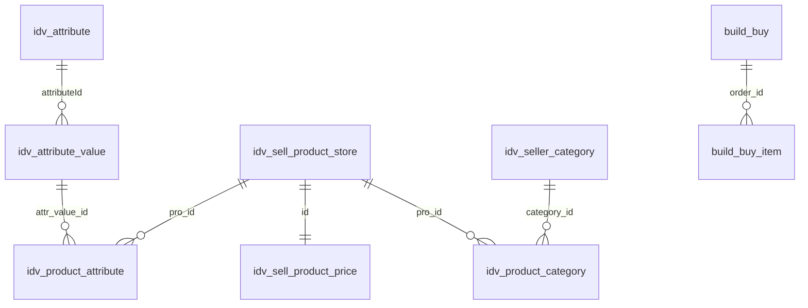

# Database Runtime Schema Reference

**Database:** `hanoi23_db`  
**Verified:** `2026-07-06`  
**Tables:** `241`  
**Source:** live `information_schema` inspection

Tài liệu này thay thế snapshot cũ bị generate lỗi với placeholder `$Table`. Đây là runtime reference cho các module đang được ứng dụng sử dụng, không phải migration file.

## Tổng quan vật lý

| Thuộc tính | Giá trị |
|---|---|
| Tables | 241 |
| InnoDB | 113 |
| MyISAM | 128 |
| Collation | `latin1_swedish_ci` trên 241 bảng |
| Physical foreign keys | Không đầy đủ; phần lớn quan hệ ở tầng ứng dụng |

`TABLE_ROWS` trong `information_schema` là estimate đối với InnoDB, chỉ dùng để đánh giá quy mô.

## Product catalog

### `idv_sell_product_store`

Catalog sản phẩm chính.

| Cột ứng dụng dùng | Ý nghĩa |
|---|---|
| `id` | Product id |
| `storeSKU` | Mã SKU |
| `proName` | Tên sản phẩm |
| `brandId` | Tham chiếu logic tới `idv_brand.id` |
| `proThum` | Tên file thumbnail |
| `warranty` | Thông tin bảo hành |
| `postDate`, `lastUpdate` | Thời gian quản trị |

Estimated rows: khoảng `21,158`.

### `idv_sell_product_price`

Giá và trạng thái bán; quan hệ 1-1 logic qua `id = idv_sell_product_store.id`.

| Cột | Kiểu | Ý nghĩa |
|---|---|---|
| `id` | `int unsigned`, PK | Product id |
| `price` | `double` | Giá bán hiện tại |
| `market_price` | `double` | Giá thị trường |
| `isOn` | `tinyint(1)`, indexed | Đang bật bán |
| `quantity` | `tinyint` | Quantity legacy, chưa dùng làm kiểm tra tồn kho checkout |
| `lastUpdate` | `datetime` | Lần cập nhật giá |

Estimated rows: khoảng `28,616`.

## Category

### `idv_seller_category`

Metadata và hierarchy category.

| Cột ứng dụng dùng | Ý nghĩa |
|---|---|
| `id` | Category id |
| `parentId` | Category cha |
| `name` | Tên category |
| `url` | Slug category |
| `ordering` | Thứ tự hiển thị |

Estimated rows: khoảng `1,617`.

### `idv_product_category`

Junction product-category. Đây không phải bảng metadata category.

| Cột | Kiểu | Index |
|---|---|---|
| `category_id` | `int` | `category_id` |
| `pro_id` | `int` | `pro_id` |
| `brandId` | `mediumint` | `brandId` |
| `price` | `int` | `price` |
| `ordering` | `mediumint` | - |
| `status` | `tinyint(1)` | - |

Estimated rows: khoảng `88,057`.

Quan hệ logic:

```text
idv_seller_category.id
    -> idv_product_category.category_id
    -> idv_product_category.pro_id
    -> idv_sell_product_store.id
```

## Attributes

| Bảng | Vai trò | Estimated rows |
|---|---|---:|
| `idv_attribute` | Định nghĩa attribute | 347 |
| `idv_attribute_value` | Giá trị attribute | 2,446 |
| `idv_attribute_category` | Attribute áp dụng cho category | 3,885 |
| `idv_product_attribute` | Product gắn attribute value | 242,304 |

Quan hệ logic:

```text
idv_attribute.id
    -> idv_attribute_value.attributeId
    -> idv_product_attribute.attr_value_id
    -> idv_product_attribute.pro_id
    -> idv_sell_product_store.id

idv_attribute.id
    -> idv_attribute_category.attr_id
idv_seller_category.id
    -> idv_attribute_category.category_id
```

Indexes quan sát được:

- `idv_attribute_category(category_id)`
- `idv_product_attribute(attr_value_id)`
- `idv_product_attribute(pro_id)`

Database có dữ liệu legacy không phù hợp làm filter label, ví dụ URL hoặc `javascript:void(0)`. API category attributes hiện sanitize các giá trị này trước khi trả storefront.

## URL routing

### `idv_url`

| Cột | Kiểu | Vai trò |
|---|---|---|
| `id` | `int`, PK | Row id |
| `request_path` | `varchar(400)` | Slug/public path |
| `request_path_index` | `varchar(50)`, indexed | Lookup hỗ trợ |
| `id_path` | `varchar(250)`, indexed | Internal entity path |
| `target_path` | `varchar(250)` | Redirect target |
| `redirect_code` | `varchar(6)` | Redirect status |

Estimated rows: khoảng `32,709`.

Product slug mapping đang dùng:

```sql
u.id_path = CONCAT('module:product/view:product-detail/view_id:', p.id)
```

## Orders

### `build_buy`

| Cột | Kiểu | Ghi chú implementation hiện tại |
|---|---|---|
| `id` | `int`, PK | Order id |
| `product_title` | `varchar(255)` | Tên product hoặc summary nhiều item |
| `total_value` | `float` | Tổng verified từ quote |
| `product_id` | `int` | Product id nếu một item, nếu nhiều item là `0` |
| `buyer_info` | `text` | JSON customer/receiver/delivery/payment/invoice |
| `config` | `text` | JSON items/totals/note |
| `status` | `tinyint(1)` | Insert hiện tại dùng `1` |
| `create_time`, `last_update` | `int` | Unix timestamp |

Estimated rows tại lần audit: `6`.

### `build_buy_item`

| Cột | Kiểu | Ghi chú |
|---|---|---|
| `id` | `int`, PK | Line id |
| `order_id` | `mediumint` | Tham chiếu logic tới `build_buy.id` |
| `product_id` | `int` | Product id |
| `title` | `varchar(255)` | Product title snapshot |
| `product_price` | `int` | Giá verified tại thời điểm order |
| `quantity` | `mediumint` | Số lượng |

Estimated rows tại lần audit: `33`.

`build_buy_item.order_id` hiện không có secondary index trong snapshot. Nếu order list/detail tăng tải, cần đo query trước khi đề xuất migration index.

## News

| Bảng | Vai trò | Estimated rows |
|---|---|---:|
| `idv_seller_news` | Metadata bài viết | 2,485 |
| `idv_seller_news_content` | Nội dung bài viết | 2,365 |
| `idv_seller_news_category` | Danh mục tin | xem runtime |

## Quan hệ commerce đang dùng



Các đường trên là quan hệ logic; không được giả định database có foreign key/cascade.

## Cách re-check schema

```sql
SELECT COUNT(*)
FROM information_schema.tables
WHERE table_schema = 'hanoi23_db';
```

```sql
SELECT table_name, column_name, column_type, column_key
FROM information_schema.columns
WHERE table_schema = 'hanoi23_db'
ORDER BY table_name, ordinal_position;
```

Sau mỗi migration/schema change, cập nhật lại file này, `STATISTICS.md` và `QUICK_REFERENCE.md` trong cùng commit.

